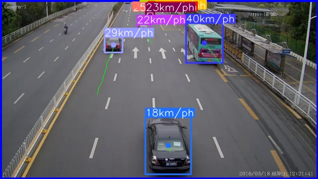
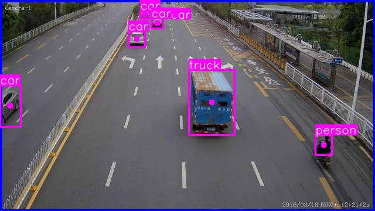
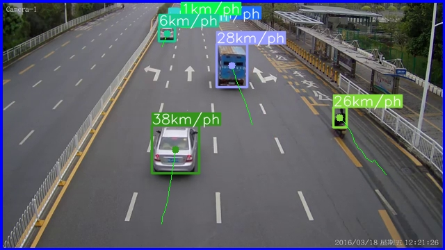
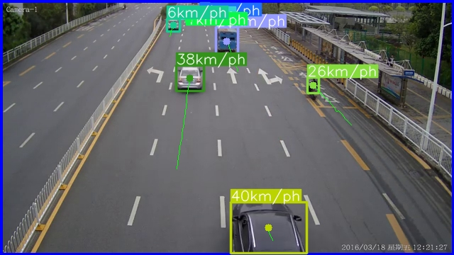

# Проект AutoSpeedGuard

## Цель
Создать программу для записи видео с закрытой территории тогда, когда на ней происходит движение автомобиля.

## Описание
MVP данного проекта представляет собой программу, которая анализирует загруженное видео и выделяет из него кадры, на которых происходит движение автомобиля. После этого программа сохраняет эти видео, содержащие кадры с движением автомобиля и их скорость.

## Технологии
- YOLOv8
- OpenCV
- Docker

## План работы
### 1. Поиск проблемы и описание решения

#### Описание проблемы:

Существует проблема обеспечения безопасности на закрытых территориях, таких как парковки, автостоянки, или частные участки. Владельцам этих территорий часто бывает сложно отслеживать и реагировать на возможные инциденты, такие как угоны автомобилей. Существующие системы видеонаблюдения могут быть неэффективными или требуют постоянного внимания для мониторинга.

#### Целевая аудитория:
Владельцы закрытых территорий, такие как паркинги, автостоянки, а также частные лица, которым важна безопасность своего автотранспорта.

#### Идеальный продукт:
Программа анализирект видео-поток с камер видеонаблюдения и сохраняет видео-файлы, содержащие кадры с движением автомобиля и его скоростью.

#### MVP:
Программа принимает видео-файл и сохраняет видео-файл, содержащий кадры с движением автомобиля и его скоростью.

### 2. Поиск обученной модели и датасета

Сейчас для задачи детекции автомобилей существует множество обученных моделей. Однако самой популярной и широко используемой является модель YOLO (You Only Look Once). Версия YOLOv8 является одной из самых современных и точных моделей для детекции объектов.
Она уже обучена на большом датасете, который включает в себя множество изображений с автомобилями.
Тестировалось на видео из этого [датасета](https://www.kaggle.com/datasets/prateek3g/vehicle-speed-estimation).

### 3. Выбор фреймворка для разработки демо

Недавно пробовал связку FastAPI + Streamlit в Docker контейнере. Она показала себя хорошо, поэтому решил использовать ее для разработки демо.
Но так как в этот раз было видео, решил оставить только Streamlit в Docker контейнере.

### 4. Разработка демо

Код демо находится в папке `app`. Для запуска демо нужно выполнить следующую команду:
`streamlit run app/main.py`

### 5. Встраивание модели-детектора в демо

Для детекции автомобилей использовалась модель YOLOv8. Из пакета `ultralytics` была взята готовая реализация этой модели. Для определения скорости автомобиля использовался Estimator из того же пакета (speed_estimation).

### 6. Тестирование демо

Демо было протестировано на видео из датасета. Оно успешно обнаружило автомобили и определило их скорость.
Хотя корректность определения скорости автомобиля не была проверена, так как в датасете не было информации о скорости автомобиля.
Но в целом по собственным наблюдениям, скорость определяется не совсем корректно.

Таблица с результатами тестирования:

|  |  |  |  |
|-------------------------------------------------------------------------------|-------------------------------------------------------------------------------|--------------------|--------------------|

Развёртывать демо на сервере не стал, так как это требует дополнительных затрат.